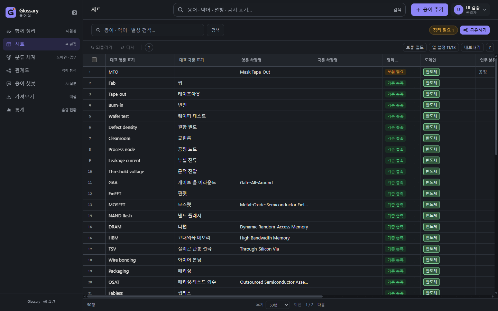
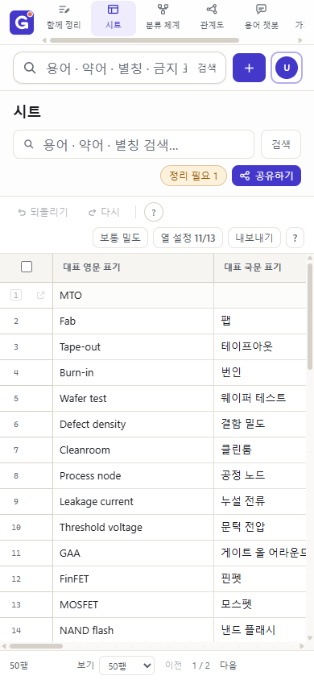

# UI/UX 개선 검증 기록

2026-09-09~10, 로컬 Next.js 개발 서버와 기존 94개 용어를 사용해 검증했다.
리뷰 기준은 [Web Interface Guidelines](https://github.com/vercel-labs/web-interface-guidelines/blob/main/command.md)의 탐색, 접근성, 입력, 콘텐츠 처리 항목이다.

## 개선 사항

| 확인한 문제 | 적용한 개선 |
| --- | --- |
| 모바일 메뉴가 아이콘만 표시되어 목적지를 구별하기 어려움 | 메뉴 이름을 표시하고 터치 높이를 44px로 확대 |
| 모바일 시트가 페이지 전체로 늘어나 하단 페이지 이동에 접근하기 어려움 | 화면 높이에 맞춘 표 내부 스크롤, 상단 메뉴의 1px 높이 오차 제거 |
| 숨겨진 도움말이 용어 입력 화면을 가로로 늘림 | 열릴 때만 포털로 렌더링하고 화면 경계에 맞춰 배치, 터치·포커스·Escape 지원 |
| 도움말 버튼이 16px로 작음 | 24px 터치 영역 적용 |
| 사용자 관리 표의 화면 밖 접근성 라벨이 페이지 가로 넘침을 발생시킴 | 표 스크롤 영역에 위치 기준을 설정 |
| 작은 보조 글자와 일부 밝은 테마 상태 배지의 색 대비 부족 | 밝은/어두운 테마의 보조 글자, 밝은 테마의 경고/완료 색 보정 |
| 상단 검색창에 클릭할 검색 실행 버튼이 없음 | 이름이 있는 검색 버튼 추가, 홈의 주 검색 버튼 강조 |
| 긴 검색 후보와 키보드 이동 시 표시 영역 처리 부족 | 긴 표기 말줄임, 선택한 후보 자동 스크롤 |
| 계정 메뉴의 방향키 탐색과 닫은 뒤 포커스 복원 부족 | 방향키·Home·End 지원, Escape 후 실행 버튼으로 복원, 메뉴 밖 이동 시 닫기 |
| 전체 화면 편집기의 Tab 이동이 배경으로 빠질 수 있음 | 화면 안에서 Tab/Shift+Tab 순환, 닫은 뒤 실행 버튼으로 복원 |
| 모바일 기본 폼 글자와 화면 식별 정보 부족 | 기본 입력 글자 16px, 새 용어 페이지 제목, 중복된 분류 화면 h1 정리 |

## 검증

- 타입 검사: `pnpm --filter @glossary/web typecheck` 통과.
- 관련 Vitest 12개 파일, 93개 테스트 통과. UI 구조, 검색 처리, Markdown, 분류, 시트 페이지, 검색어 전달, 대비 회귀 검사를 포함한다.
- `ui-contrast.test.ts`는 실제 CSS 토큰을 읽어 밝은 테마, 시스템 다크, 명시적 다크의 본문/보조 글자, 상태 배지, 기본/호버 버튼 색 대비가 4.5:1 이상인지 계산한다. 모든 화면의 모든 색 조합을 검사하는 것은 아니다.
- 브라우저: 320·390·768·1440px에서 아래 16개 경로를 순회한 64개 조합 모두 문서 가로 넘침 없음. 마지막 순회에서 콘솔 오류 없음.
- 경로: `/`, `/sheet`, `/new`, `/contribute`, `/classifications`, `/graph`, `/chat`, `/import`, `/settings`, `/w/mto`, `/admin`, `/admin?tab=quality`, `/admin?tab=ai`, `/admin?tab=sso`, `/admin?tab=users`, `/statistics`.
- 실제 동작: 검색 버튼 제출, 자동완성 방향키 선택과 Escape 닫기, 검색 결과 없음 안내, 계정 메뉴 처음/마지막 항목 이동과 포커스 복원, 테마 전환, 도움말 화면 경계·Escape 닫기, 사용자 검색 빈 결과와 초기화, 공유 창 열기·닫기·포커스 복원, 전체 화면 편집기 크기·Tab 순환·Escape 복원 확인.
- 모바일 시트 최종 측정: 390×844px에서 문서 크기도 390×844px. 표 내부 스크롤과 하단 페이지 이동을 확인했다.
- 스크린샷을 너무 일찍 촬영했을 때 촬영 도구의 caret 숨김 스타일이 hydration 경고를 발생시켰다. 페이지를 다시 로드하고 hydration 후 `caret: initial`로 재촬영하여 오류가 재현되지 않음을 확인했다. 아래 이미지는 개발 도구 배지만 숨긴 최종 화면이다.

API/DB 전체 통합 테스트, 실제 모바일 Safari, 실제 스크린리더, 외부 AI/SSO 연결 동작은 이번 UI 검증에 포함하지 않았다. 관리자 화면의 설정 저장이나 다른 사용자의 권한 변경은 실행하지 않았다. 검증용 로컬 계정과 해당 세션은 검증 후 삭제했다.

## 최종 화면

### 데스크톱 · 어두운 테마

### 모바일 · 밝은 테마

